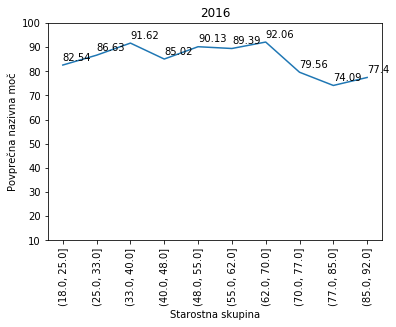

# PR2018AGARLP #

### Avtorji ###

* Aljaž Glavač
* Andraž Raspor
* Luka Perovič

## Vmesno poročilo o opravljenem delu ##
### 13.4.2018 ###

## Predstavitev naše množice podatkov ##

Množica podatkov nad katero bomo opravljali raziskave in ugotavljali kakšne vplive imajo določeni atributi na druge, smo našli na spletni strani www.podatki.gov.si. Na omenjeni spletni strani so različni statistični podatki zbrani iz Slovenije, kar je tudi razlog, da smo se odločili uporabljati te podatke oz. množico podatkov.

Naša množica sestoji iz podatkov o prvič registriranih vozilih v Sloveniji. Podatki so razdeljeni po mescih in so dostopni za od leta 2012 do 2017.

Za to množico podatkov smo se odločili saj se nam je zdela zelo zanimiva za ugotavljanje trendov, kakšne avtomobile slovenci kupujejo, ter druge lastnosti o posameznikovi izbiri avtomobila.

Pri izbiri podatkovne množice smo gledali tudi na to, da vsebuje dovolj podatkov za opazovanje. Našli smo veliko drugih podatkov, ki bi bolj ustrezali naši stroki, kot na primer; različna uporaba interneta v slovenskih gospodnistvih, vendar so bile take množice zelo majhne. Pri tako majhni količini podatkov bi bili zagotovo omejeni glede raziskave.

## Manjšanje množice podatkov ##

Ko smo, po skupni odločitvi in izbiri podatkov prvič prenesli podatke iz spletne strani smo naleteli na zelo veliko težavo. Kot smo že prej napisali smo izbrali to podatkovno množico, ker je bila tako velika. Vendar se je sedaj izkazalo, da je podatkov preprosto preveč. Preveč jih je bilo za na git ter preveč za naše raziskovanje.

Nato smo se odločili, da iz celotne podatkovne množice vzamemo samo tri leta.
* 2015
* 2016
* 2017

pri vsakem letu smo vzeli vseh 12 mesecev.

## Problem encodinga ##

Ker so podatki iz spletne strani, se med imeni atributov in njihovimi vrednostmi (opisali jih bomo kasneje) najdejo tudi šumniki.

Ko smo prenesli in zreducirali našo množico, smo ugotovili, da veliko šumnikov naš jupyter notebook ne prepozna, in zato prikaže čudne znake. Zadali smo si, da to nekako popravimo. To bi nam pomagalo pri izbiranu vrednosti iz množice (šumnikov nebi bilo mogoče izbrati saj "š" znak ni "š" znak ampak nek drugi znak). Pomagali bi nam pa tudi pri reprezentaciji imen atributov na grafih.

Po dolgem raziskovanju kateri encoding uporabiti smo se odločili da ta problem in pomankljivost naše množice zanemarimo. Prej naštet problem izbiranja določenih vrstic, je bil rešen z uporabo idjev katere smo prenesli zraven naših podatkov. Uporabili smo samo encoding 'latin1' kateri prikaže samo določene šumnike.

Kot primer uporabe idjev:

Stolpec "barva vozila" vsebuje vrednost Črna, ki se v našem primeru izpiše pravilno, zato je bil zraven stolpca "barva vozila" dodan tudi stolpec "id barve vozila". Ta nam omogoča da v excel tabeli najdemo črno barvo in nato preko poizvedbe po stoplcu z idji barve izberemo vse tiste vrstice oz. avtomobile, ki so črne barve.

## Branje podatkov ##

Množica podatkov, ki smo jo prenesli iz spletne strani je bila v obliki csv datotek, kar nam je mogočalo branje le teh z uporabo csv readerja v naših jupyter notebookih. Iz vseh stolpcev smo izbrali samo določene stolpce, saj nas drugi niso zanimali pri naših raziskavah.

Opis izbranih atributov se nahaja malo nižje, pod naslovom, Opis atributov in vrednosti.

Primer branje datoteke.
```python
df1501 = pd.read_csv("../data/2015/Podatki_012015.csv", encoding='latin1', sep=';', decimal=',', usecols=stolpci, dtype=tipi)
#                    1.                                 2.                 3.       4.           5.               6.
```
1. pot do datoteke
2. encoding ki delno "razume" šumnike
3. nastavitev razdelilnika na ';'
4. decimalna števila se preberejo z ',' ne z '.'
5. izbira samo določenih stolpcev
6. določanje podatkovnega tipa stolpcev

## Opis atributov in vrednosti ##

* Datum prve registracije, kjerkoli in nato še samo v SLO - zvezna atributa
* Status vozila - diskretni atribut (odjavljeno, registrirano, v postopku)
* Izvajalna enota prve registracije - diskretni atribut
* Starost uporabnika vozila - zvezni atribut
* Ali je uporabnik pravna ali fizicna oseba  - diskretni atribut (P ali F)
* Spol uporabnika - diskretni atribut - (M ali Z, prazno če je oseba pravna)
* Upravna enota - diskretni atribut
* Občina - diskretni atribut
* Starost lastnika vozila - zvezni atribut
* Znakma - diskretni atribut (Audi, Alfa Romeo, Volkswagen...)
* barva - diskretni atribut (kovinski-BELA-SREDNJA, kovinski-BELA-SVETLA...)
* teža vozila - zvezni atribut
* Vrsta goriva - diskretni atribut (bencin, dizel, zem. plin...)
* Število sedežev (število) - diskretni atribut
* Dolžina, širina in višina - zvezni atributi
* Leto izdelave - diskretni atribut

## Grafi ##

### Prikaz štavila registriranih vozil v letu 2015, urejenih po tipu goriva. ###

```python
gorivo = data.groupby('P.1.3-Vrsta goriva (opis)')['P.1.3-Vrsta goriva (opis)'].count().sort_values(ascending=False)
```


Kot je iz grafa razvidno, največ novo registriranih prevoznih sredstev uporablja dizel, na drugem mestu je bencin, in tako naprej. Ostala goriva kot so; naftni plin, kombinirana goriva in zemeljski plin, so tako redka, da se jih na grafu niti ne vidi. Pozitivno opažanje iz grafa je to, da so vozila na električni pogoj na tretjem mestu, kar je dobro za naš planet. Vendar sta nafta in bencin kar krepko pred elektriko.

### Prikaz števila registiranih motornih vozil ki za svoje delovanje uporabljajo gorivo tipa mešanica. ###

```python
mesanica = dict()
for m,data in zip(mesec,df15):
	    mesanica[m] = len(data[data['P.1.3-Vrsta goriva (oznaka)'] == 'M'])

plt.bar(range(len(mesanica)), mesanica.values(), color='pink')
plt.xticks(range(len(mesec)), mesec)
plt.xticks(rotation=90)
```


Kot vidimo je največ takih vozil registriranih v mesecu Juniju in Juliju, oziroma poleti.
Iz tega lahko razberemo da se je takrat registriralo največ motorjev, skuterjev ter podobnih prevoznih stredstev na dveh kolesih.
Kar je tudi logično saj se pozimi ni mogoče vozit s takimi prevoznimi sredstvi. Poleti pa je to velik trend.


### Povprečna nazivna moč osebnih avtomobilov glede na starostno skupino. ###
#### Priprava podatkov za ta graf ####

```python
# iz podatkov vzamem le osebne avtomobile (vozila z oznako M1)
dataOA = data[data['J-Kategorija in vrsta vozila (oznaka)'] == "M1"]

#ker bom primerjal po starosti iz podatkov vzamem le vnose, kjer je znana starost
dataOAS = dataOA[dataOA['C-Starost uporabnika vozila']>0]

#starost spremenim v kategorije
dataOAS['C-Starost uporabnika vozila'] = pd.cut(dataOAS['C-Starost uporabnika vozila'], 10 retbins=True)[0]

#naredim slovar, kjer za vsako starostno skupino dodam nazivne moci avtomobilov
ageHP = dict()
for a in dataOAS['C-Starost uporabnika vozila']:
    if(a not in ageHP):
        ageHP[a] = [dataOAS['P.1.2-Nazivna moc'][dataOAS['C-Starost uporabnika vozila']==a].values]

#nato izracunam povprecno moc za posamezno skupino
avgHP = []
for ag in ageHP:
    avgHP.append(sum(ageHP[ag][0]) / len(ageHP[ag][0]))

plt.bar(range(len(starost)), avgHP)
plt.ylim(ymax = 100, ymin = 10)
plt.xticks(range(len(starost)), starost)
plt.xticks(rotation=90)
plt.ylabel('Povprečna nazivna moč')
plt.xlabel('Starostna skupina')
```


Iz grafa je razvidno, da imajo v povprečju najmočnejše avtomobile osebe stare med 32 in 40 leti ter osebe stare med 62 in 70 leti. Pričakovali smo malo drugačne rezultate. Mislili smo, da bodo najmočnejše avtomobile imele osebe mlajše od 40 let.
Kot vidimo se povprečna moč zmanjša po 40 letu starosti, nato pa spet dvigne pri 62. Sklepamo, da so osebe nad 60 leti finančno močnejše in si zato lahko privoščijo močnejše avtomobile, hkrati pa imajo verjetno tudi manj družinskih in službenih obveznosti.

### Prikaz držav iz katerih izvira največ na novo registriranih vozil ###

```python
drzava = data.groupby('D.4.2-Drzava (opis)')['D.4.2-Drzava (opis)'].count().sort_values(ascending=False)
plot = drzava[:10].plot.bar()
```


Na grafu je prikazanih 10 držav iz katerih izvira največ vozil. Vidimo, da jih je največ iz Nemčije (50293 vozil), prbližno polovico manj pa iz Francije (26057 vozil). Sledi Češka republika (9957 vozil).

### Prikaz občin kjer je resistriranih največ vozil ###

```python
obcine = data.groupby('C1.3-Obcina uporabnika vozila (opis)')['C1.3-Obcina uporabnika vozila (opis)'].count().sort_values(ascending=False)
plot = obcine[:10].plot.bar()
```


Na grafu je prikazanih 10 občin v katerih se na novo registrira največ vozil. Razvidno je, da se jih največ registrira v Ljubljani (31380 vozil), kar je skoraj petkrat več kot v Mariboru, ki je naslednji po številu registracij (6629 vozil). V Ljubljani se registrira kar 22,6 % novih vozil v Sloveniji.
